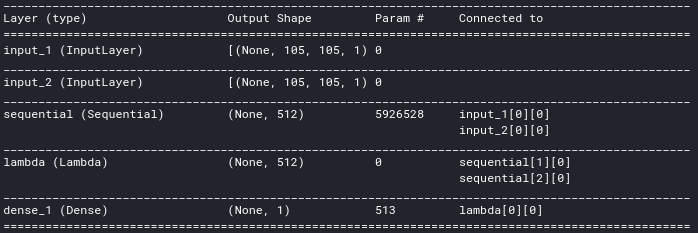

# Omniglot-Siamese-Network

This is in-line with the challenge posted originally by Fellowship AI [here](https://fellowship.ai/challenge). This notebook has been majorly inspired from Harshall Lamba's [One Shot Learning with Siamese Networks using Keras](https://towardsdatascience.com/one-shot-learning-with-siamese-networks-using-keras-17f34e75bb3d).

Omniglot dataset includes a collection of 20 images for each letter in 50 languages' scriptures. Since, this dataset is too small to train a multi-class classifier, we can use Siamese Networks which handles such datasets very well. In Siamese Networks, we train a model which identifies how similar 2 images are. Thus, having trained on the dataset of letters of 30 languages, we found the 20-way accuracy on the validation set of other unseen 20 languages to be 76 %.

## Dataset

The dataset [Kaggle Dataset | Omniglot](https://www.kaggle.com/watesoyan/omniglot) was used for training. However, this dataset is actually derived from [Brenden Lake | Omniglot data set for one-shot learning](https://github.com/brendenlake/omniglot).

## Model

## Learning Curves

## Links

* [Kaggle Kernel | Kartik Shenoy | Omniglot Dataset Siamese Networks](https://www.kaggle.com/kartik2112/omniglot-dataset-siamese-networks)
* [Google Collab Notebook Link](https://colab.research.google.com/drive/1adB1bed-fpD_kfynO75ZqEzpPpmD8DkA?usp=sharing)
